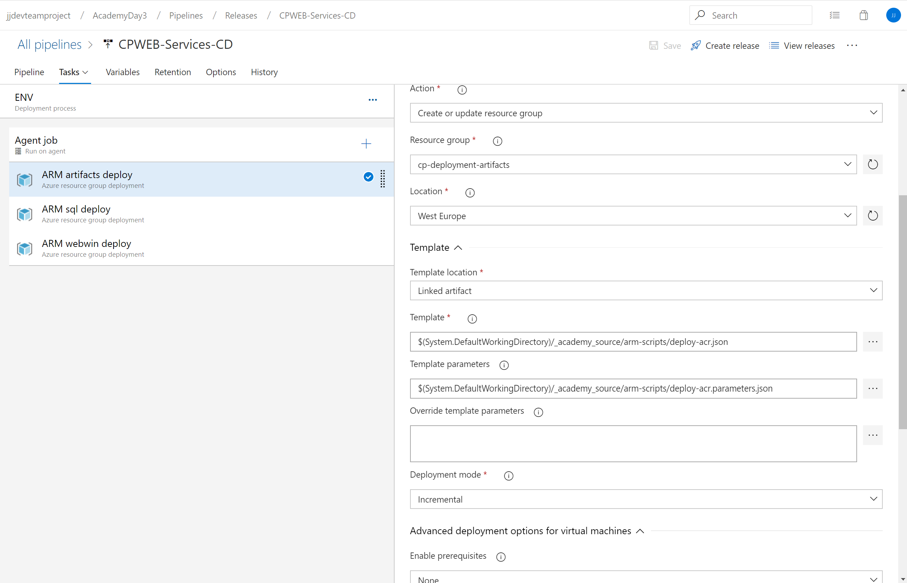

# Azure Technical Academy - Hybrid IT Day 3: containers

## Prerequisities
- All day1 and day2 labs completed and knowledge of all topics covered
- Homework from day2 completed and shared with instructors via private message on Teams
- Access to own Azure subscription as Owner (access to single Resource Group is not enough for this lab)
- Rights to create Service Principal in AAD or precreated Service Principal with credentials
- Sufficient quota in subscription
  - 10 or more total vCPUs in region West Europe
  - 10 or more B-series VM vCPUs in region West Europe
- Precreated Azure DevOps organization with full rights for purpose of this Lab, instructions in [documentation](https://docs.microsoft.com/en-us/azure/devops/organizations/accounts/create-organization?view=azure-devops)

## Prepare Azure services for application

### Deploy Azure services manually

Check scripts in [arm-scripts](arm-scripts) and update parameter values.

```powershell
#$uniqueId = "-" + [system.environment]::MachineName
$uniqueId = ""
cd .\arm-scripts\
```

Run this script to deploy Azure Container Registry

```powershell
$rgArtifacts="cp-deployment-artifacts"+$uniqueId
az group create -l westeurope -n $rgArtifacts
az group deployment create -g $rgArtifacts `
    --template-file deploy-acr.json `
    --parameters deploy-acr.parameters.json
```

Run this script to deploy Azure Sql database

```powershell
$rgSql="cp-sql"+$uniqueId
az group create -l westeurope -n $rgSql
az group deployment create -g $rgSql `
    --template-file deploy-sql.json `
    --parameters deploy-sql.parameters.json --parameters administratorLoginPassword=Azure123
```

Run this script to deploy Azure WebApp for Containers with Windows Containers with reference to Azure Container Registry and Azure Sql.
Check parameters file for correct ACR name and Sql name/password.

```powershell
$rgWebWin="cp-web-win"+$uniqueId
az group create -l westeurope -n $rgWebWin
az group deployment create -g $rgWebWin `
    --template-file deploy-webwin.json `
    --parameters deploy-webwin.parameters.json --parameters sqlServerPassword=Azure123
```

Run for WebApp for Containers with Linux Containers

```powershell
$rgWebLinux="cp-web-linux"+$uniqueId
az group create -l westeurope -n $rgWebLinux
az group deployment create -g $rgWebLinux `
    --template-file deploy-weblinux.json `
    --parameters deploy-weblinux.parameters.json --parameters sqlServerPassword=Azure123
```

### Deploy Azure services with Azure DevOps

Utilize your knowledge from Day2 and do following steps:

1. Create new DevOps Project AcademyDay3
2. Clone this Github repo into Azure Repos https://github.com/azurecz/azuretechacademy-hybridit-labs-day3.git and name it _academy_source
3. Create new Release pipeline CPWEB-Services-CD
4. Configure pipeline to deploy Azure services with ARM deployment - artifacts, Sql (-administratorLoginPassword Azure123), Web for Windows

**Sample of one task**


**Sample of definition for Sql deployment task**

```yaml
steps:
- task: AzureResourceGroupDeployment@2
  displayName: 'ARM sql deploy'
  inputs:
    azureSubscription: 'YOUR-SUBSCRIPTION'
    resourceGroupName: 'cp-sql'
    location: 'West Europe'
    csmFile: '$(System.DefaultWorkingDirectory)/_academy_source/arm-scripts/deploy-sql.json'
    csmParametersFile: '$(System.DefaultWorkingDirectory)/_academy_source/arm-scripts/deploy-sql.parameters.json'
    overrideParameters: '-administratorLoginPassword Azure123'
```

## Building and storing container images with Azure Container Registry

We will deploy sample Todo web application from https://github.com/tkubica12/dotnetcore-sqldb-tutorial

### Build docker image with Azure DevOps

We will push Linux and Windows image into Azure Container Registry using Azure DevOps.

First clone source code to Azure Repos

1. Import git https://github.com/tkubica12/dotnetcore-sqldb-tutorial.git into new Azure Repos repository

Steps to create new release pipeline for Windows deployment

1. Create new Release pipeline CPWEBWINDOWS-CD
2. Create DEV stage
3. Add artefact referencing source code dotnetcore-sqldb-tutorial and name it _source
4. Make sure Agent job running windows-2019
5. Add Docker task command buildAndPublish
    - add Docker registry pointed to Azure Container Repository cpacr
    - container registry type cpweb
    - select dockerfile
    - tags $(Release.ReleaseId)-windows

Repeat steps for Linux deployment with Release pipeline name CPWEBLINUX-CD

1. Add new Agent job running Ubuntu and repeat same steps
    - tags $(Release.ReleaseId)-linux

**Sample of definition for Docker build task**

```yaml
steps:
- task: Docker@2
  displayName: 'buildAndPush - Windows'
  inputs:
    containerRegistry: cpacr
    repository: cpweb
    Dockerfile: '$(System.DefaultWorkingDirectory)/_source/Dockerfile'
    tags: '$(Release.ReleaseId)-windows'
```

### Build Docker image with ACR Tasks (option)

You can run docker build remotely with [Azure Container Registry Tasks](https://docs.microsoft.com/en-us/azure/container-registry/container-registry-tasks-overview)

Run this script to build docker image for Windows and Linux

```powershell
az acr build -r cpacr https://github.com/tkubica12/dotnetcore-sqldb-tutorial.git -f Dockerfile --platform Windows -t cpweb:0-windows --build-arg BASE_IMAGE=mcr.microsoft.com/dotnet/core/aspnet:2.1-nanoserver-1809 --no-wait
az acr build -r cpacr https://github.com/tkubica12/dotnetcore-sqldb-tutorial.git -f Dockerfile --platform Linux -t cpweb:0-linux --no-wait
```

## Using containers with Azure Container Instances (optional)

You can run simply docker image in [Azure Container Instances](https://docs.microsoft.com/en-us/azure/container-instances/).

```powershell
az acr credential show --name cpacr
$acrPassword="YOUR_ACR_PASSWORD"
az group create -n cp-aci -l westeurope
az container create -g cp-aci -n cpwebw --image cpacr.azurecr.io/cpweb:0-windows --cpu 1 --memory 4 --registry-login-server cpacr.azurecr.io --registry-username cpacr --registry-password $acrPassword --ports 80 --os-type Windows --ip-address Public
az container create -g cp-aci -n cpwebl --image cpacr.azurecr.io/cpweb:0-linux --cpu 1 --memory 2 --registry-login-server cpacr.azurecr.io --registry-username cpacr --registry-password $acrPassword --ports 80 --os-type Linux --ip-address Public
```

*Note: ACI with Windows containers supports 10.0.14393 (Windows 2016) and 10.0.17763 (Windows 2019) versions only.*

*Note: In Preview program you can run ACI in existing Azure Virtual Network and get private IP address, check [link](https://docs.microsoft.com/en-us/azure/container-instances/container-instances-vnet)*

## Using containers with Azure Web Apps for Containers

### Windows docker images running on WebApps with DevOps

We will modify existing pipeline CPWEBWINDOWS-CD to deploy Windows container to Azure App Service for Containers

1. Add new task *Azure Web App for Containers* to Windows part
    - select Subscription and App name
    - image name: cpacr.azurecr.io/cpweb:$(Release.DeploymentID)-windows

Repeat same steps for Linux container deployment to Azure App Service for Containers.

### Test application changes and automated deployment

Now you can test to change source code and deploy it.

## Creating and connecting Azure Kubernetes Service

Before we jump into Kubernetes discussion let's create Azure Kubernetes Service cluster. We will use simple solution (no AAD login integration, no custom networking etc.) to start with.

Create resource group

```powershell
az group create -n cp-aks -l westeurope
```

Create AKS. Note for this to work you need to be Contributor on your subscription and your AAD account needs to have permissions to create service principal (if not, read next). Note that CLI creates service principal account and it might take some to replicate - if command fails initialy, try again.

```powershell
az aks create -g cp-aks `
    -n yourname-aks `
    -c 2 `
    --enable-addons monitoring `
    --generate-ssh-keys `
    --network-plugin azure
```

If you do not have permissions to do so, try to:
- You may use service principal account you have prepared beforehand. Make sure service principal is Contributor in your subscription. Use --client-secret and --service-principal
- AKS needs to create additional resource group with raw resources. Default name is MC_myResourceGroup_myAKSCluster_myregion. You can configure different name, but as of this writing you cannot point AKS to group that already exists. For now your service principal need to have rights on subscription level.

Next we need to download kubectl and we can use Azure CLI to do so. 

```powershell
az aks install-cli
```

Or you can download it yourself - it is single binary for Windows or Linux found [here for Windows](https://storage.googleapis.com/kubernetes-release/release/v1.16.0/bin/windows/amd64/kubectl.exe) and [here for Linux](https://storage.googleapis.com/kubernetes-release/release/v1.16.0/bin/linux/amd64/kubectl).

Wait for deployment to finish and then download connection information:

```powershell
az aks get-credentials -n yourname-aks -g cp-aks --admin
```

There is one more thing we need to do. We need to give AKS access to our container repository in cp-deployment-artifacts resource group. We will add Service Principal used for AKS creation as Contributor to our repository. You can find ID using this command:

```
az aks show -n yourname-aks -g cp-aks --query servicePrincipalProfile.clientId -o tsv
```

Use GUI to go to your container repository, click Access Control (IAM) and add new assignment for role AcrPull and search for principal with ID you get with previous command.


## Kubernetes: basic theory
As we wait for AKS to get created let's discuss how Kubernetes work and what are main objects we will use today. Follow instructor and you can download presentation [here](https://github.com/tkubica12/kubernetes-demo/blob/master/PPT-CZ/Kubernetes%20-%20jak%20funguje.pptx?raw=true)

## Kubernetes: Pods
Kubernetes files are stored in kubernetes folder.

First modify podApp.yaml image: to reflect your container repository and tag for Linux version of our application.

Deploy Pod

```powershell
kubectl apply -f podApp.yaml
```

We can list running Pods. With -w we can stream changes od Pod status so you might see status changing from ContainerCreating to Running etc.

```powershell
kubectl get pods -w
```

If something goes wrong check more details about Pod including log of state changes.

```powershell
kubectl describe pod todo
```

Note that you can also get logs via kubectl (use -f for streaming).

```powershell
kubectl logs todo
```

Pod is not exposed to outside of our cluster (we will do that later), but we can use kubectl to create encrypted tunnel for troubleshooting. Create port-forwarding and open browser on http://localhost:54321/api/version

```powershell
kubectl port-forward pod/todo 54321:80
```

Pod is basic unit of deployment and by itself it does not provide additional functionality such as redeploying Pod if something goes wrong (such as node going down). We can see that by deleting Pod. It will just die and no other Pod will be deployed as replacement.

```powershell
kubectl delete pod todo
kubectl get pods -w
```

## Kubernetes: Deployments
Rather that using Pod directly let's create Deployment object. Controller than creates ReplicaSet and making sure that desired number of Pods is always running. There are few more configurations we have added as best practice that we are going to need later in lab.

First modify deploymentApp1replica.yaml image: to reflect your container repository and tag for Linux version of our application.

Deploy.

```powershell
kubectl apply -f deploymentApp1replica.yaml
kubectl get deploy,rs,pods
```

We will now kill our Pod and see how Kubernetes will make sure our environment is consistent with desired state (which means create Pod again). 

```powershell
kubectl delete pod todo-54bb8c6b7c-p9n6v    # replace with your Pod name
kubectl get pods
```

Scale our deployment to 3 replicas. First modify deplymentApp3replicas.yaml image: to reflect your container repository and tag for Linux version of our application.


```powershell
kubectl apply -f deploymentApp3replicas.yaml
kubectl get deploy,rs,pods
kubectl get pods -o wide
```

Now let's play a little bit with labels. There are few ways how you can print it on output or filter by label. Try it out.

```powershell
# print all labels
kubectl get pods --show-labels    

# filter by label
kubectl get pods -l app=todo

# add label column
kubectl get pods -L app
```

Note kthat the way how ReplicaSet (created by Deployment) is checking whether environment comply with desired state is by looking at labels. Look for Selector in output.

```powershell
kubectl get rs
kubectl describe rs todo-54bb8c6b7c   # put your actual rs name here
```

Suppose now that one of your Pods behaves strangely. You want to get it out, but not kill it, so you can do some more troubleshooting. We can edit Pod and change its label app: todo to something else such as app: todoisolated. What you expect to happen?

```powershell
kubectl edit pod todo-54bb8c6b7c-xr98s    # change to your Pod name
kubectl get pods --show-labels
```

What happened? As we have changed label ReplicaSet controller no longer see 3 instances with desired labels, just 2. Therefore it created one additional instance. What will happen if you change label back to its original value?

```powershell
kubectl edit pod todo-54bb8c6b7c-xr98s    # change to your Pod name
kubectl get pods --show-labels
```

Kubernetes have killed one of your Pods. Now we have 4 instances, but desired state is 3, so controller removed one of those.

## Kubernetes: exposing apps with Services
Kubernetes includes internal load balancer and service discovery called Service. This creates internal virtual IP address (cluster IP), load balancing rules are DNS records in internal DNS service. In order to get access to Service from outside AKS has implemented driver for type: LoadBalancer which calls Azure and deploy rules to Azure Load Balancer. By default it will create externally accessible public IP, but can be also configured for internal LB (for apps that should be accessible only within VNET or via VPN).

Let's create one. Note "selector". That is way how Service identifies Pods to send traffic to. We have intentionaly included labels app and component, but not type (you will see why later in lab).

```powershell
kubectl apply -f serviceApp.yaml
kubectl get service
```

Note that external IP can be in pending state for some time until Azure configures everything.

While we wait we will test service internally. Create Pod with Ubuntu, connect to it and test internal DNS name and connectivity.

```powershell
kubectl apply -f podUbuntu.yaml
```

For troubleshooting you can exec into container and run some commands there or even jump using interactive mode to shell. Note this is just for troubleshooting - you should never change anything inside running containers this way. Always build new container image or modify external configuration (we will come to this later) rather than doing things inside.

Jump into container and try access to service using DNS record.

```powershell
kubectl exec -ti ubuntu -- /bin/bash
curl todo-app/api/version
```

Azure Stack has by now allocated public IP to deployed Service. You can get it via kubectl get services. When using scripts we can use jsonpath for direct parsing.

```powershell
$extPublicIP = $(kubectl get service todo-app -o jsonpath='{.status.loadBalancer.ingress[0].ip}')
Invoke-RestMethod $extPublicIP/api/version -DisableKeepAlive
```

## Kubernetes: Application rolling upgrade
Kubernetes Deployment support rolling upgrade to newer container images. If you change image in desired state (typically you change tag to roll to new version of your app). Deployment will create new ReplicaSet with new version and orchestrate rolling upgrade. It will add new version Pod and when it is fully up it removes one with older version and so until original ReplicaSet is on size 0. Since tags we used for Service identification are the same for both we will not experience any downtime.

In one window start curl in loop.

```powershell
$url = "$(kubectl get service todo-app -o jsonpath='{.status.loadBalancer.ingress[0].ip}')/api/version"
while($true) {Invoke-RestMethod $url -DisableKeepAlive}
```

First modify depoymenAppV2.yaml image: to reflect your container repository and tag for Linux version of our application, but this time use different tag with different version of your application.


```powershell
kubectl apply -f deploymentAppV2.yaml
```

## Kubernetes: Monitoring and logging

## Kubernetes: using ConfigMaps and Secrets
ASP .NET Core can be se to Development mode (when app crashes it writes details to web), which can be useful for Dev environment. But in Production we should not reveal such messages. This is set via ASPNETCORE_ENVIRONMENT variable. Currently we have this setting directly in our Deployment YAML file which means we need to change this file between dev and production environment, which is not good idea. YAML should stay and we should maintain configuration in separate object - ConfigMap. That can be used as source for ENV variables, but also can inject complete configuration files into container file system. When container needs some file such as config.ini we do not want to package it during container build, because then we need different image for dev and production. In order for image to stay the same, we can use ConfigMaps to inject that file when deploying container and do not modify image itself.

In our lab we will use ConfigMap just as source for ENV ASPNETCORE_ENVIRONMENT, nevertheless for demonstration our webConfigMap.yaml also contains example of complete configuration file (we will demonstrate injecting it, but is not used by our app).

Deploy ConfigMap.

```bash
kubectl apply -f webConfigMap.yaml
```

Look into deploymentAppConfigs.yaml and modify image to reflect your repository and tag. Check how we are filling ASPNETCORE_ENVIRONMENT and also using Volume to inject configuration file to /myconfigs path in container.

Deploy deploymentAppConfigs.yaml. Check application is still running, ENV has been populated and files injected.

```bash
kubectl apply -f deploymentAppConfigs.yaml

# In following commands replace pod name to reflect yours
kubectl exec todo-c48749d7f-b9t56 -- env
kubectl exec todo-c48749d7f-b9t56 -- ls /myconfigs
kubectl exec todo-c48749d7f-b9t56 -- cat /myconfigs/config.ini
```

Next task is to connect our application to SQL. App is designed to read connection string from environmental variable SQLCONNSTR_mojeDB. Again we do not want to store such sensitive information in deployment YAML file, nor ConfigMap. To enable proper management of secrets we will use Secret object in Kubernetes and fill env from it.

First let's create secret with SQL connection string. For now we will do that from command line, not from YAML file as we do not want to store any secrets in our repo. Modify this command with your connection string.

```bash
kubectl create secret generic db --from-literal=connectionString="copyConnectStringFromGui-setCredentials"
```

Modify deploymentAppSecrets.yaml to include your image and study how ENV is filled from Secret. Deploy.

```bash
kubectl apply -f deploymentAppSecrets.yaml
```

Check your application now works and you can write todos to database.

## Kubernetes: packaging deployments with Helm
We now have quite a few components that need to be deployed in order for application to work - Service, Deployment, Configmap and Secret. Consider how more complex it is when you will have multiple services and other objects such as Volumes, Ingress or even more complex objects such as service mesh, network policy and others. It would be nice to package this all into single deployment unit.

Also there is another problem - we had to modify YAML files to reflect our image. When we create new version, we need to modify it again. It would be better to have some templating language so we do not have to change YAMLs all the time and rather specify some attributes as variables or even create complex YAML structures on the fly.

Both can be satisfied with Helm - deployment and packaging solution for Kubernetes.

First download Helm. It is single binary, so for windows you can download exe file [here](https://get.helm.sh/helm-v2.14.3-windows-amd64.zip) and copy to some folder that is in your PATH.

Note: for this lab we will use Helm 2 that requires cluster-side components. There is Helm 3 available in beta that has enhanced architecture in a way that cluster-side components are not neccessary. As it comes to final release, consider migrating to Helm 3.

Next we need to create service account in Kubernetes that cluster-side Helm component will use to deploy resources.

```bash
kubectl apply -f tiller-rbac.yaml
```

Let's now initialize Helm so it will install cluster-side component. After a minute check Helm version and you should get response from both Client and Server.

```bash
helm init --service-account tiller
helm version
```

Study Helm chart. Templates folder includes all yaml templates and we have created very simple modifications to pass key arguments during deployment. Non-sensitive parameters can be stored in values file, but for secret (connection string) we will pass it during deploment directly.

First delete all existing objects and deploy complete solution via Helm. Secrets are base64 encoded. We could have encode via Helm, but to avoid interpretaion hell (Helm is parsing, Shell is parsing), we will provide already base64 encoded connection string.

```powershell
kubectl delete deploy,pod,service,configmap,secret --all
cd ..\app-helm
$connectionString = "ConnectStringFromGui-setCredentials"
$Bytes = [System.Text.Encoding]::UTF8.GetBytes($connectionString)
$EncodedText =[Convert]::ToBase64String($Bytes)
helm upgrade --install `
    -f values-dev.yaml `
    --set "app.imagetag=5-linux" `
    --set "SQLConnectionString=$EncodedText" `
    todo .
```

Check our application is up and running.

Happy with that? Let's delete it now to clean up resources as we will start deploying from Azure DevOps.

```powershell
helm delete todo --purge
```

## Kubernetes: pushing application from Azure DevOps
We will now enable Continuous Deployment of Dev environment from Azure DevOps. Modify your CPWEBLINUX-DC pipeline.

- Add it_academy_source repo as another artifact
- Add task "Helm tool installer"
- Add task "Package and deploy Helm charts" 
  - rename to "App deploy"
  - select your subscription, AKS resource group and your AKS cluster
  - check Use cluster admin credentials
  - specify Namespace default
  - Command will be upgrade
  - Chart Type is File Path
  - for Chart Path point to app-helm folder
  - Release Name will be todo
  - In Set values add SQLConnectionString=base64encodedstring,app.imagetag=$(Release.ReleaseId)-linux (copy base64endodedstring from your PowerShell session from $EncodedText variable we created before)
  - Point to value file values-dev.yaml
  - Make sure Install if release not present is check and also Wait is checked

Save and create Release. Check progress. We should see our application get installed to AKS. Get Service IP and check application is up and running.

We will now practice creating additional stage for Prod. It should use different database, but for our demo we will use the same one to make it simple. 

Kubernetes comes with concept of Namespaces to isolate management of different environments. Let's create production namespace:

```powershell
kubectl create namespace prod

# When accessing non-default namespace use -n in your commands such as:
kubectl get pods -n prod  # You should see no pods there
```

Let's now add PROD stage to our pipeline:

- Click on Clone button to get copy of your DEV stage
- Rename to PROD
- Go to tasks and delete container build task (we already have image built from previous stage)
- Modify app deployment:
  - change Namespace to prod
  - change Release Name to todo-prod
  - point to different value file - values-prod.yaml
- Go back to pipeline view and click on lighting symbol in PROD stage and enable Pre-deployment approvals and add yourself as approver

Save and create new Release.

Your DEV should get deployed and then pipeline stops. Check your DEV version is running fine. We are satisfied with this release so let's approve rolling it to production. Click on Approve. App will get deployed to prod namespace. Get external IP address (when it becomes available) and check app in production works.

```powershell
kubectl get service -n prod
```

Note: In practice it is risky to run dev and prod on the same AKS custer if you are not advanced in scheduling and protecting resources. Good practice is to use one AKS cluster for dev and test environments (two namespaces) and second AKS cluster for pre-prod (staging) and prod (again in two namespaces).

## Advanced Kubernetes (optional section for attendies using Kubernetes already)

### Azure Application Gateway as Ingress
Follow [Ingress guide](./ingress.md)

### Serverless in Kubernetes with KEDA and Azure Functions
Follow [KEDA guide](./keda.md)

### Distributed Application Runtime
Follow [DAPR guide](./dapr.md)

### Service Mesh
Follow [Istio guide](./istio.md)

## Contacts

### Tomas Kubica - Cloud Solutions Architect
- https://www.linkedin.com/in/tkubica
- https://github.com/tkubica12
- https://twitter.com/tkubica

### Jaroslav Jindrich - Cloud Solutions Architect
- https://www.linkedin.com/in/jjindrich
- https://github.com/jjindrich
- https://twitter.com/jjindrich_cz
